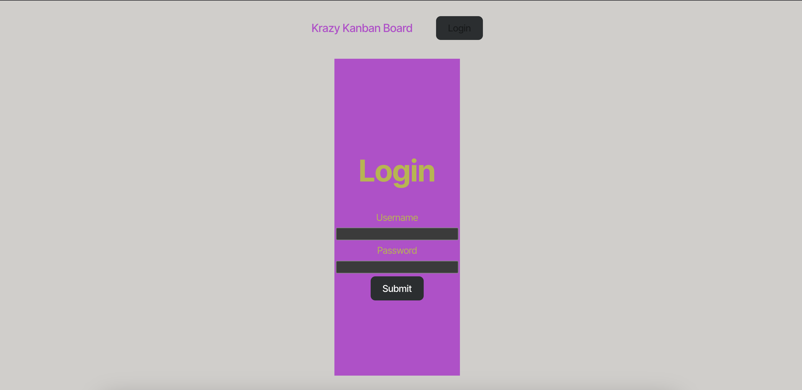
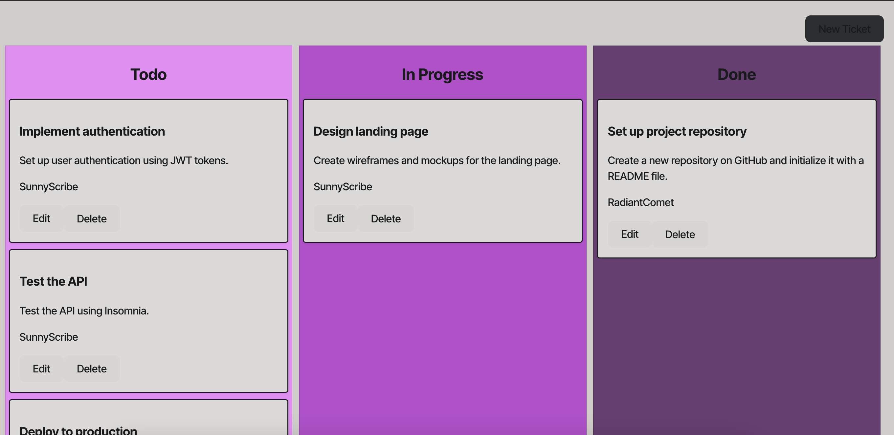

# WhatToDo

## Description

A Kanban Board Application designed for streamlined task management. This app allows users to organize and prioritize their tasks visually using boards, lists, and cards. It features user authentication to ensure data security and personalized experiences.

## Features

- User Authentication:
    - Secure login funcionality using JWT and password hashing
    - Prevents unauthorized access to user boards.

- Kanban Board Management:
    - Create, Update, and delete boards.
    - Add, edit and organize tasks.

## Usage

### login

1. Launch the app and navigate to login page.
2. Enter username and password to access your personalized kanban board.

### Board and Tasks

- Create tasks for different projects and place them in either todo, In progress or done.
- Update tasks by user.

## Tecnologies Used

- Frontend:
    - React, Typescript, css.

- Backend:
    - Node.js, Express, PostgreSQL.

- Authentication:
    - JWT, bcrypt.

## Contact 

Oscar Rendon

Code sourced with help ChatGPT

- github Link: https://github.com/Danr55/WhatToDo
- Website Link: https://whattodo-k2m9.onrender.com/

- Test Username: SunnyScribe
- Test Password: password